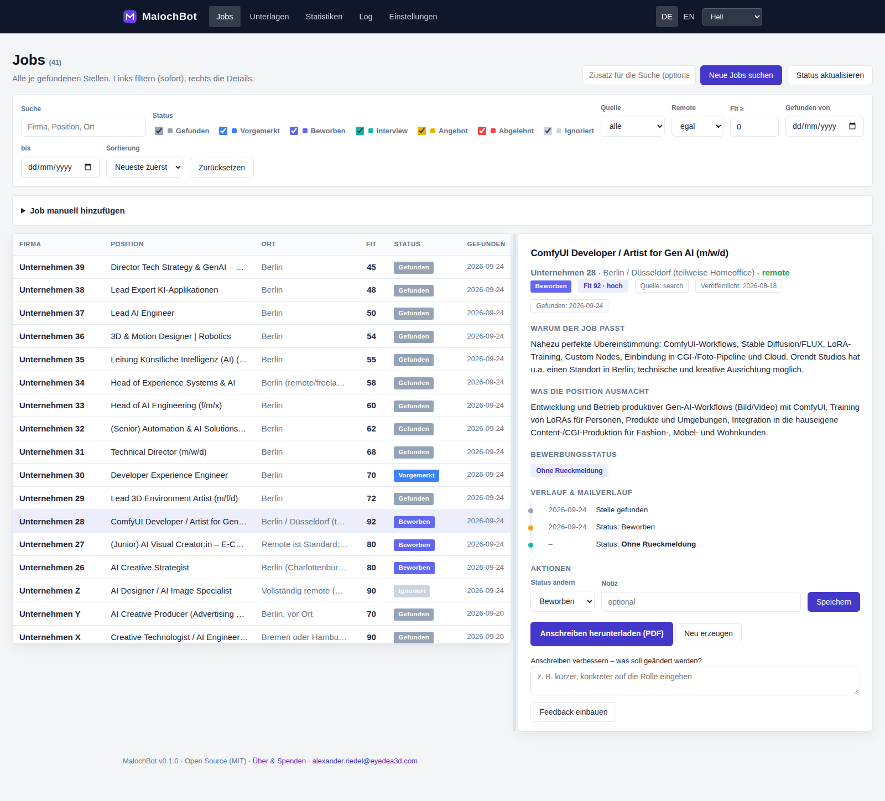
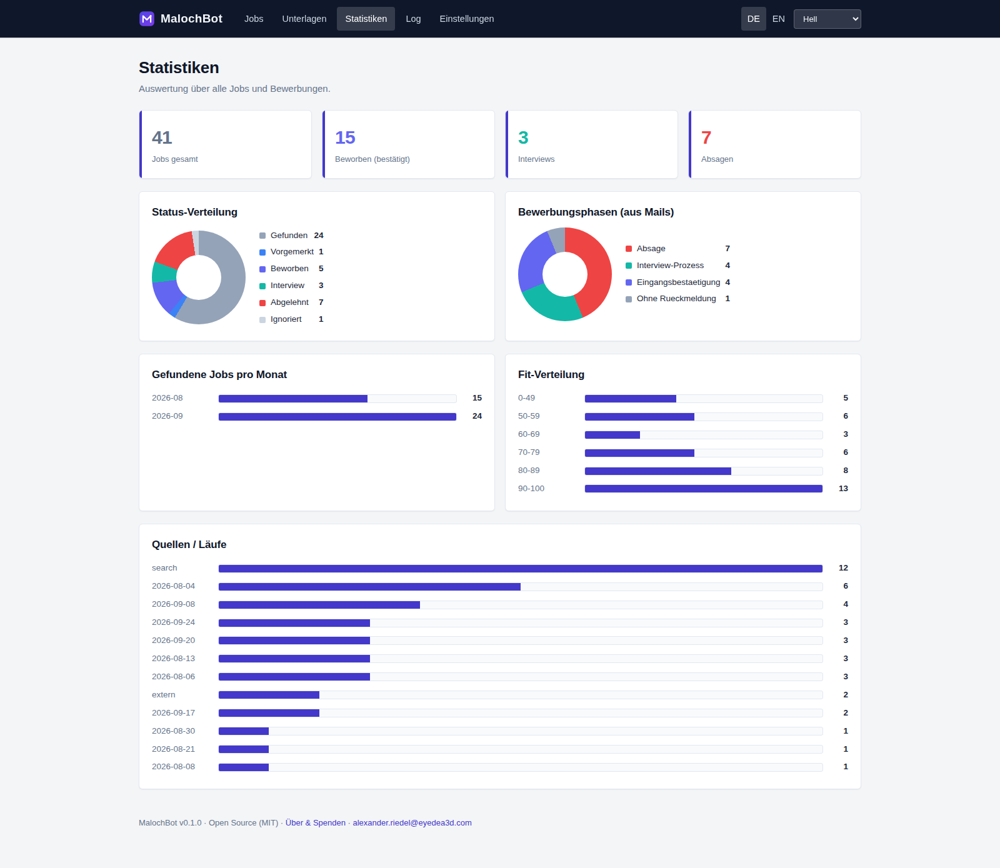
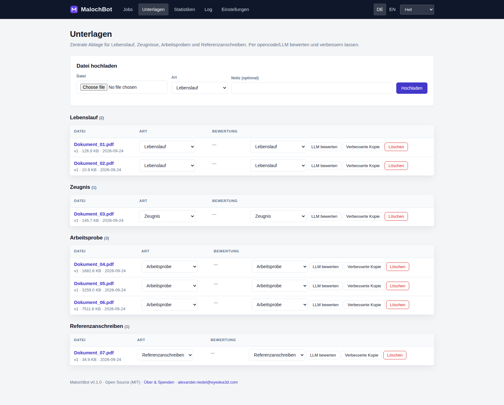

<p align="center"></p>

# MalochBot

> Die Maloche der Jobsuche nimmt dir MalochBot ab.

MalochBot ist eine lokale Open-Source-Webanwendung, die **Jobsuche, Bewerbungsverwaltung
und Karriereunterlagen** an einem Ort bündelt. Alle Analysen laufen über
[opencode](https://opencode.ai) und ein frei wählbares LLM.

## Funktionen

- **Jobs finden** – per Button eine Suche starten; neue Stellen werden gefunden,
  dedupliziert und in der Datenbank abgelegt.
- **Eine Ansicht für alles** – links die filterbare Liste aller gefundenen Stellen
  (Filter in Echtzeit), rechts das Detailfenster mit Fit-Begründung, Beschreibung,
  Ort/Remote, Status, Links zur Stelle und zum Unternehmen sowie zugeordneten Mails.
- **Bewerbungen tracken** – Mailkonto verbinden (Gmail, Outlook, GMX, WEB.DE, STRATO,
  IONOS, mailbox.org, Posteo, Yahoo, iCloud, Zoho, Fastmail oder eigener Server);
  Mails werden read-only per IMAP gelesen und der Status per LLM bewertet.
- **Unterlagen** – Lebenslauf, Zeugnisse, Arbeitsproben und Referenzanschreiben zentral
  ablegen, per LLM bewerten/verbessern lassen und Anschreiben erzeugen.
- **Modellwahl** – Dropdown aller in opencode verfügbaren Modelle; Analysen laufen immer
  über opencode.
- **Live-Log** – jeder Prozessschritt in Echtzeit, fehleranalysetaugliche Logdateien.
- **Vier Themes** – Hell, Dunkel, Nord, Sepia (Umschalter oben rechts).
- **Sicher** – Zugangsdaten im OS-Keyring, kein Secret im Repository, kein Telemetrie.

## Dokumentation

- [Arbeitsprobe (PDF)](docs/MalochBot-Arbeitsprobe.pdf) — Projekt und Denkweise
- [Technische Dokumentation](docs/DOKUMENTATION.md) · [PDF](docs/MalochBot-Dokumentation.pdf)

## Screenshots







## Installation

### Linux / macOS
```bash
cd MalochBot
./install.sh     # installiert opencode (falls nötig), Python-Deps, Datenbank
./run.sh         # startet den Server und öffnet http://127.0.0.1:8765
```

### Windows
```bat
cd MalochBot
install.bat
run.bat
```

Die Installer prüfen/installieren **opencode**, legen eine virtuelle Umgebung an und
initialisieren die Datenbank. Danach im Browser unter **Einstellungen** Modell und
Mailkonto einrichten (einmalig).

## Betrieb

- `run.sh`/`run.bat` beenden eine laufende Instanz und starten den Server neu
  (keine Doppel-Instanzen). Für den Dauerbetrieb auf einem Server eignet sich ein
  systemd-Service (siehe unten).
- **Manuell beenden:** Einstellungen → „Server beenden".
- Die **Modellliste** wird live vom System geladen (`opencode models`), nach Anbieter
  gruppiert.

## Da­uerbetrieb (Server)

Für den dauerhaften Betrieb (z. B. auf VEGA) `MALOCHBOT_HOST=0.0.0.0` setzen, damit der
Dienst im Netz erreichbar ist. Ein systemd-Unit liegt unter `deploy/malochbot.service`
(nutzerbezogen, `systemctl --user`) und `deploy/malochbot-system.service` (systemweit).

## Voraussetzungen

- Python 3.10+
- [opencode](https://opencode.ai) (die Installer versuchen es mitzuinstallieren)
- Optional LibreOffice für PDF-Export von Anschreiben

## Architektur

```
MalochBot/
  app/
    main.py          FastAPI-App, Routen, SSE-Logstream
    db.py            SQLite-Schema und Zugriffe (alle Jobdaten)
    secrets.py       Secret-Store (Keyring / verschlüsselte Datei)
    logbus.py        Live-Logs + Persistenz
    opencode_adapter.py  Aufruf der opencode-CLI
    providers.py     Mail-Anbieter-Presets
    import_legacy.py Import bestehender Daten
    engines/         search, tracking, documents
    templates/       Oberfläche
    static/          CSS/JS
  data/              Laufzeitdaten (DB, Uploads, Logs) – nicht im Repo
```

## Sicherheit

Siehe [SECURITY.md](SECURITY.md). Mailpasswörter und Keys werden nie im Repository
gespeichert. Der Code ist vollständig einsehbar; es findet kein Telemetrie-Versand statt.

## Lizenz

MIT – siehe [LICENSE](LICENSE).

## Unterstützen

Wenn dir MalochBot Zeit spart:
**PayPal: [alexander.riedel@eyedea3d.com](https://www.paypal.com/donate?business=alexander.riedel%40eyedea3d.com&item_name=MalochBot)** ❤️
