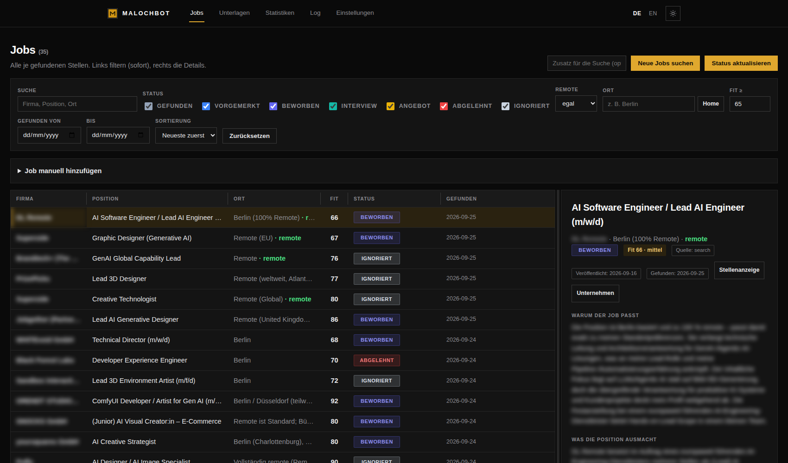
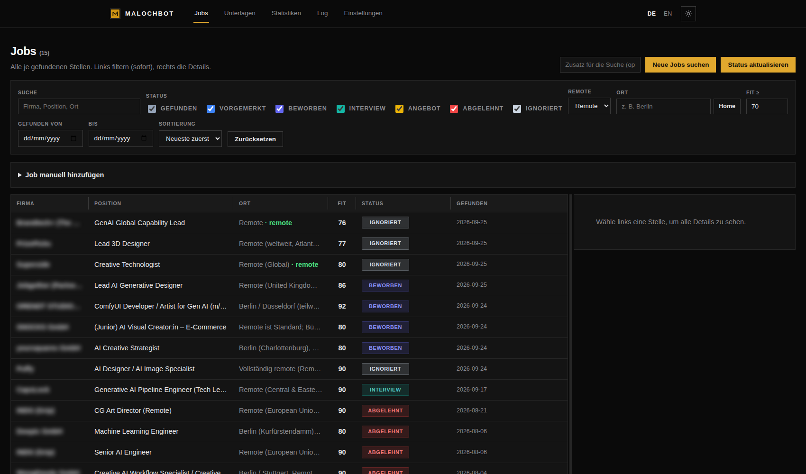
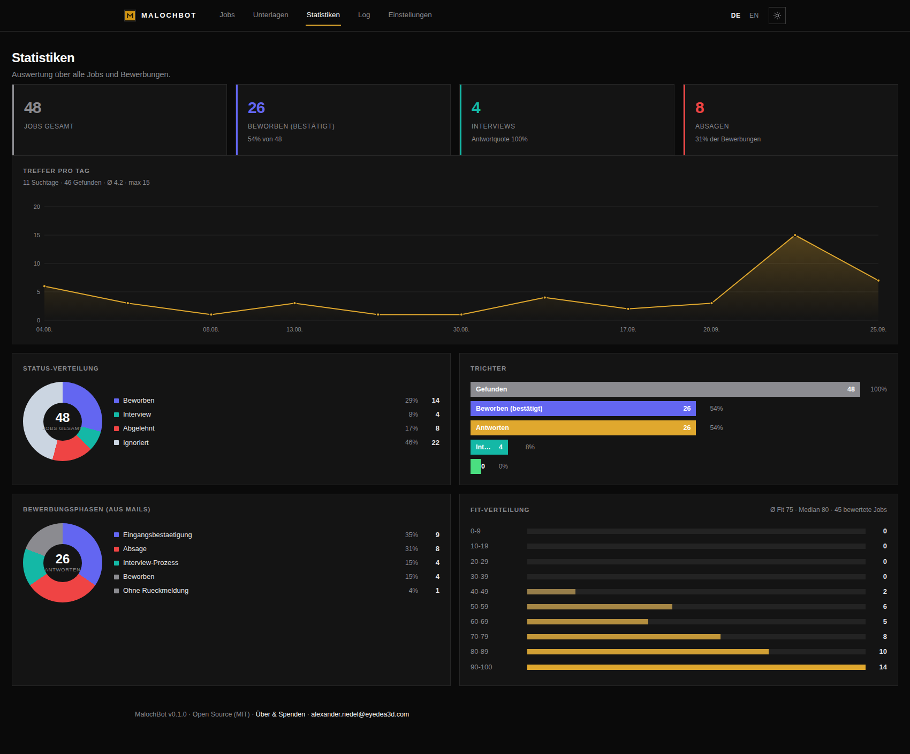
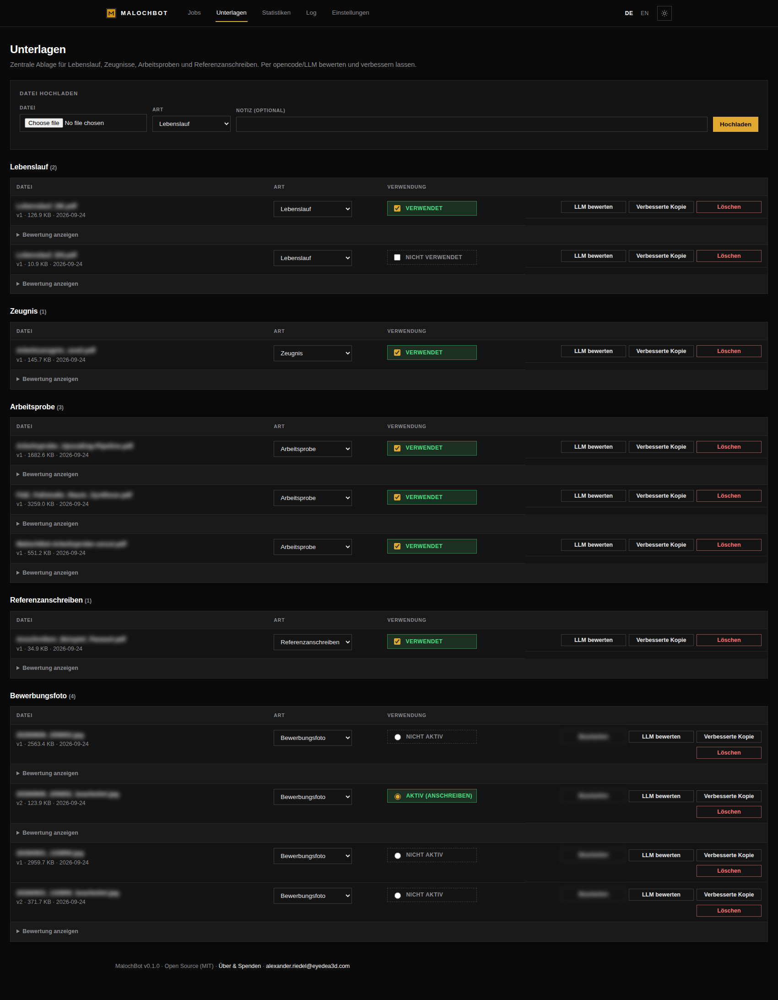
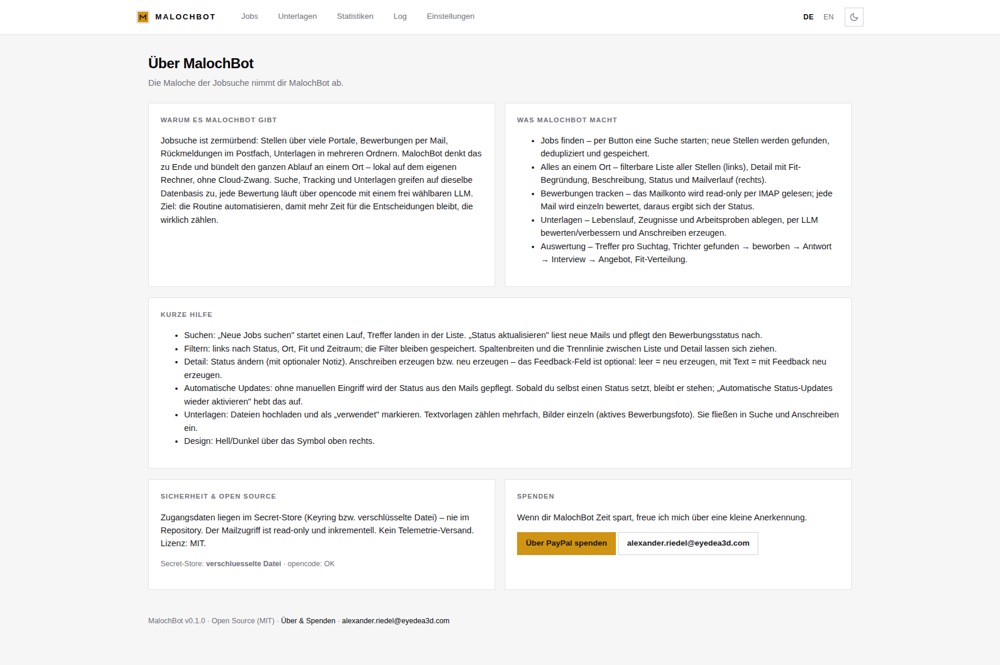

<p align="center"></p>

# MalochBot

> Die Maloche der Jobsuche nimmt dir MalochBot ab.

MalochBot ist eine lokale Open-Source-Webanwendung, die **Jobsuche, Bewerbungsverwaltung
und Karriereunterlagen** an einem Ort bündelt. Alle Analysen laufen über
[opencode](https://opencode.ai) und ein frei wählbares LLM.

## Projektziel – Jobsuche zu Ende gedacht

Jobsuche ist zermürbend: Stellenanzeigen über viele Portale, Bewerbungen per Mail,
Rückmeldungen im Postfach, Unterlagen in mehreren Ordnern. MalochBot denkt diesen Ablauf
konsequent zu Ende und bündelt ihn an **einer** Stelle – **lokal auf dem eigenen Rechner**,
ohne Cloud-Zwang. Suche, Tracking und Unterlagen greifen auf dieselbe Datenbasis zu; jede
Bewertung läuft über opencode mit einem frei wählbaren LLM. Das Ziel ist nicht, den Menschen
zu ersetzen, sondern die **Routine zu automatisieren**, damit mehr Zeit für die
Entscheidungen bleibt, die wirklich zählen: welcher Job, welches Anschreiben, welcher Termin.

## Funktionen

- **Jobs finden** – per Button eine Suche starten; neue Stellen werden gefunden,
  dedupliziert und in der Datenbank abgelegt.
- **Eine Ansicht für alles** – links die filterbare Liste aller gefundenen Stellen
  (Filter in Echtzeit), rechts das Detailfenster mit Fit-Begründung, Beschreibung,
  Ort/Remote, Status, Links zur Stelle und zum Unternehmen sowie zugeordneten Mails.
- **Bewerbungen tracken** – Mailkonto verbinden (Gmail, Outlook, GMX, WEB.DE, STRATO,
  IONOS, mailbox.org, Posteo, Yahoo, iCloud, Zoho, Fastmail oder eigener Server);
  Mails werden read-only per IMAP gelesen und der Status per LLM bewertet.
- **Unterlagen** – Lebenslauf, Zeugnisse, Arbeitsproben und Referenzanschreiben zentral
  ablegen, per LLM bewerten/verbessern lassen und Anschreiben erzeugen.
- **Modellwahl** – Dropdown aller in opencode verfügbaren Modelle; Analysen laufen immer
  über opencode.
- **Live-Log** – jeder Prozessschritt in Echtzeit, fehleranalysetaugliche Logdateien.
- **Auswertung** – Treffer pro Suchtag, Trichter (gefunden → beworben → Antwort → Interview → Angebot), Fit-Verteilung.
- **Zwei Themes** – Hell und Dunkel (Umschalter oben rechts), minimalistisch und ruhig.
- **Hilfe an Bord** – „Über & Spenden" erklärt Projektziel, Bedienung und Sicherheit.
- **Sicher** – Zugangsdaten im OS-Keyring, kein Secret im Repository, kein Telemetrie.

## Dokumentation

- [Arbeitsprobe (PDF)](docs/MalochBot-Arbeitsprobe.pdf) — Projekt und Denkweise
- [Technische Dokumentation](docs/DOKUMENTATION.md) · [PDF](docs/MalochBot-Dokumentation.pdf)

## Screenshots

> Firmennamen in den Screenshots sind unkenntlich gemacht (siehe `tools/shots.js`).

**Jobliste mit Detailfenster (dunkel)**


**Gefilterte Jobliste (dunkel)**


**Auswertung (dunkel)**


**Unterlagen (dunkel)**


**Hilfe & Projektziel (hell)**


Weitere Ansichten (hell/dunkel, gefiltert) liegen in [`docs/screenshots/`](docs/screenshots/).

## Installation

### Linux / macOS
```bash
cd MalochBot
./install.sh     # installiert opencode (falls nötig), Python-Deps, Datenbank
./run.sh         # startet den Server und öffnet http://127.0.0.1:8765
```

### Windows
```bat
cd MalochBot
install.bat
run.bat
```

Die Installer prüfen/installieren **opencode**, richten die **Websuche (MCP)** ein, legen
eine virtuelle Umgebung an und initialisieren die Datenbank. Danach im Browser unter
**Einstellungen** Modell und Mailkonto einrichten (einmalig).

## Websuche (MCP) – wichtig für die Jobsuche

Die Jobsuche lässt das Modell im Web recherchieren. Dafür braucht opencode die MCP-Server
**brave-search** (Websuche) und **fetch**. Ohne sie findet die Suche nichts und bricht mit
„Keine auswertbare JSON-Antwort" ab.

- `scripts/setup_opencode_mcp.sh` (Linux/macOS) bzw. `scripts/setup_opencode_mcp.bat`
  (Windows) tragen die MCP-Server in `~/.config/opencode/opencode.json` ein — der Installer
  ruft das automatisch auf.
- Benötigt **Node.js 20+** (für `npx`/brave-search) und **uv** (für `uvx`/fetch). Fehlen sie,
  versucht das Skript eine Installation nach `~/.local/tools` (über micromamba bzw. den
  uv-Installer); sonst bitte [Node.js](https://nodejs.org) und
  [uv](https://docs.astral.sh/uv/) nachinstallieren.
- **Brave-API-Key** (kostenloser Tarif auf https://brave.com/search/api/) wird beim Setup
  abgefragt und lokal in der opencode-Config (0600) gespeichert. Ohne Key bleibt die
  Websuche deaktiviert.
- Läuft MalochBot als **systemd-Dienst**, muss der Dienst-PATH die Binärdateien enthalten,
  z. B. `Environment=PATH=/home/USER/.opencode/bin:/home/USER/.local/tools/bin:/usr/local/bin:/usr/bin:/bin`.

## Betrieb

- `run.sh`/`run.bat` beenden eine laufende Instanz und starten den Server neu
  (keine Doppel-Instanzen). Für den Dauerbetrieb auf einem Server eignet sich ein
  systemd-Service (siehe unten).
- **Manuell beenden:** Einstellungen → „Server beenden".
- Die **Modellliste** wird live vom System geladen (`opencode models`), nach Anbieter
  gruppiert.

## Da­uerbetrieb (Server)

Für den dauerhaften Betrieb (z. B. auf VEGA) `MALOCHBOT_HOST=0.0.0.0` setzen, damit der
Dienst im Netz erreichbar ist. Ein systemd-Unit liegt unter `deploy/malochbot.service`
(nutzerbezogen, `systemctl --user`) und `deploy/malochbot-system.service` (systemweit).

## Voraussetzungen

- Python 3.10+
- [opencode](https://opencode.ai) (die Installer versuchen es mitzuinstallieren)
- **Node.js 20+** und **uv** für die Websuche-MCPs (brave-search/fetch; siehe oben)
- Optional LibreOffice für PDF-Export von Anschreiben (nicht nötig – PDFs entstehen in Python)

## Architektur

```
MalochBot/
  app/
    main.py          FastAPI-App, Routen, SSE-Logstream
    db.py            SQLite-Schema und Zugriffe (alle Jobdaten)
    secrets.py       Secret-Store (Keyring / verschlüsselte Datei)
    logbus.py        Live-Logs + Persistenz
    opencode_adapter.py  Aufruf der opencode-CLI
    providers.py     Mail-Anbieter-Presets
    import_legacy.py Import bestehender Daten
    engines/         search, tracking, documents
    templates/       Oberfläche
    static/          CSS/JS
  data/              Laufzeitdaten (DB, Uploads, Logs) – nicht im Repo
```

## Sicherheit

Siehe [SECURITY.md](SECURITY.md). Mailpasswörter und Keys werden nie im Repository
gespeichert. Der Code ist vollständig einsehbar; es findet kein Telemetrie-Versand statt.

## Lizenz

MIT – siehe [LICENSE](LICENSE).

## Unterstützen

Wenn dir MalochBot Zeit spart:
**PayPal: [alexander.riedel@eyedea3d.com](https://www.paypal.com/donate?business=alexander.riedel%40eyedea3d.com&item_name=MalochBot)** ❤️
