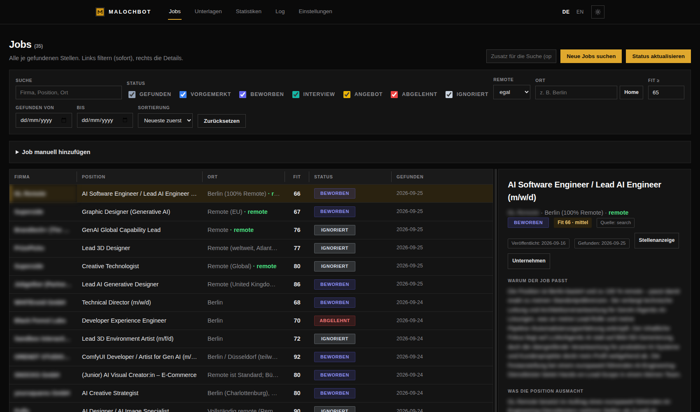
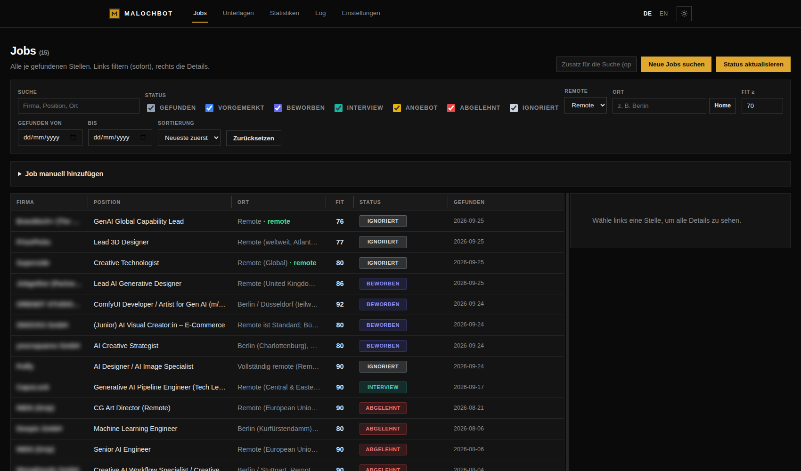
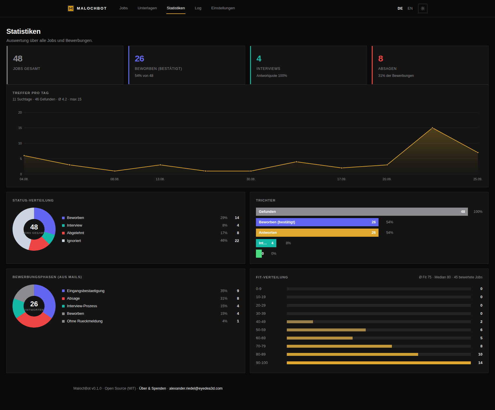
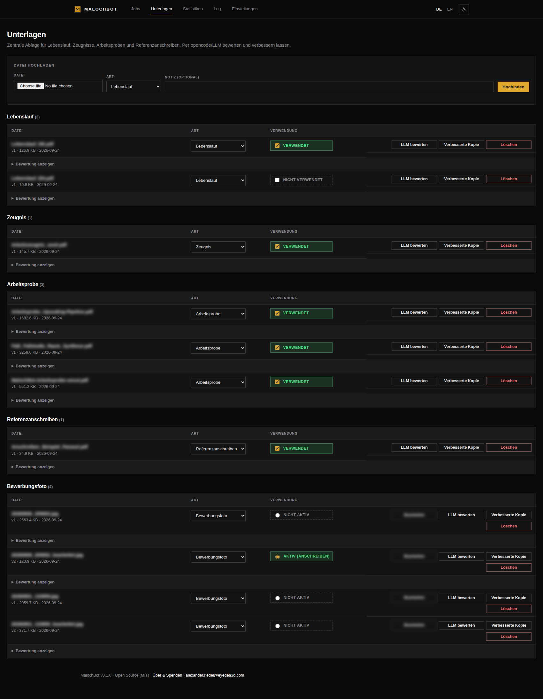
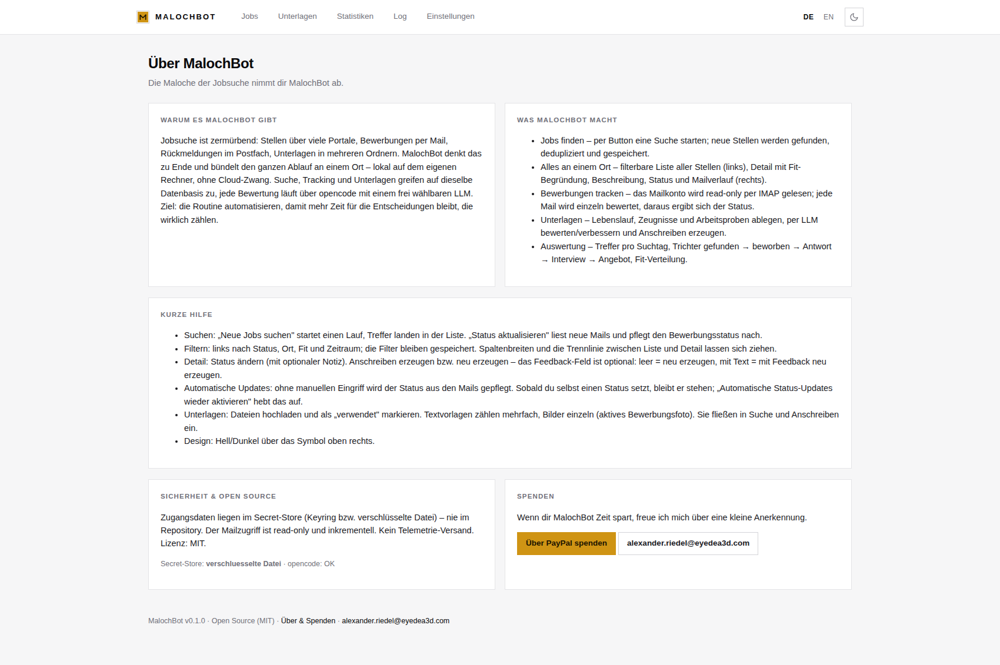

<p align="center"></p>

# MalochBot

> Job hunting is a grind. MalochBot takes it off your plate.

MalochBot is a local, open-source web app that bundles **job search, application
tracking and career documents** in one place. All analysis runs through
[opencode](https://opencode.ai) with a freely chosen LLM.

## Project goal — job hunting, thought through

Job hunting is draining: postings spread across many portals, applications by email,
replies buried in your inbox, documents in several folders. MalochBot takes that whole
process seriously and brings it together in **one** place — **locally on your own
machine**, no cloud required. Search, tracking and documents share the same data, and
every assessment runs through opencode with a freely chosen LLM. The goal is not to
replace the human, but to **automate the routine** so more time is left for the
decisions that actually matter: which job, which cover letter, which interview.

## Features

- **Find jobs** – start a search with one button. Two feeders run together: direct
  **job-board sources** (Germany's Federal Employment Agency via its official JSON API;
  LinkedIn, Indeed, Glassdoor and Google via optional JobSpy) plus the model's web search.
  New postings are de-duplicated (same company + role across boards) and stored.
- **One view for everything** – a filterable list of all jobs on the left (live filters),
  the detail panel on the right with fit rationale, description, location/remote, status,
  links to the posting and company, plus the related emails.
- **Track applications** – connect **one or more mailboxes** (Gmail, Outlook, GMX, WEB.DE,
  STRATO, IONOS, mailbox.org, Posteo, Yahoo, iCloud, Zoho, Fastmail or your own server).
  Each is read read-only via IMAP, the timeframe is shared across all, and the status is
  assessed by the LLM.
- **Documents** – keep CV, references, work samples and reference cover letters in one
  place, have them reviewed/improved by the LLM and generate cover letters.
- **Model choice** – dropdown of every model available in opencode; analysis always runs
  through opencode.
- **Live log** – every process step in real time, with logs you can debug.
- **Analytics** – hits per search day, funnel (found → applied → response → interview → offer), fit distribution.
- **Application report (PDF)** – one click exports the whole statistics plus the detailed list of every
  position you applied to (date, company, role, location, status, response, link) as a styled PDF –
  a ready proof of effort for the employment agency. A from/to month range narrows the list down
  (the summary stays complete and is labelled as such).
- **Two themes** – light and dark (toggle top right), minimal and calm.
- **Help built in** – "About & Donate" explains the project goal, how to use it and security.
- **Secure** – credentials in the OS keyring, no secrets in the repository, no telemetry.

## Documentation

- [Technical documentation (German)](docs/DOKUMENTATION.md)

## Screenshots

> Company names in the screenshots are blurred out (see `tools/shots.js`).

**Job list with detail panel (dark)**


**Filtered job list (dark)**


**Analytics (dark)**


**Documents (dark)**


**Help & project goal (light)**


More views (light/dark, filtered) live in [`docs/screenshots/`](docs/screenshots/).

**Mobile** — on small screens the layout is rebuilt: the job list becomes tappable cards, the filters collapse behind a toggle, the detail opens as a full-screen sheet (with back/gesture support), and documents/log render as cards instead of horizontally scrolling tables. `tools/shots.js` also produces mobile screenshots (`*-mobile-*`).

## Installation

### Linux / macOS
```bash
cd MalochBot
./install.sh     # installs opencode (if needed), Python deps, database
./run.sh         # starts the server and opens http://127.0.0.1:8765
```

### Windows
```bat
cd MalochBot
install.bat
run.bat
```

The installers check/install **opencode**, set up the **web search (MCP)** servers, create
a virtual environment and initialise the database. Then, in the browser under **Settings**,
pick a model and connect your mailbox (one-time setup).

### Job-board sources

Next to the model's web search, the search also queries job boards directly (see
Settings → "Job boards"):

- **Federal Employment Agency** (Bundesagentur für Arbeit) — Germany's largest job
  database, via its **official public JSON API**. No scraping, no API key, **no extra
  dependency** (Python standard library only).
- **JobSpy** — optional package for **LinkedIn, Indeed, Glassdoor, Google**. If it is not
  installed the source is skipped gracefully; everything else keeps working. Install with
  `pip install -r requirements-sources.txt` (Python ≤ 3.13; for 3.14 see the notes in that
  file).

Candidates from boards are scored by the model in a separate, tool-free step which also
writes the short "what the role is about" summary. Only candidates at or above the
configured **fit threshold** are stored (web hits too); if the scoring step fails entirely,
candidates are still stored unscored so nothing is lost. A failure in the web-search step
no longer discards the board results.

## Web search (MCP) — recommended for job search

The web search adds breadth beyond the boards. For that, opencode needs the MCP servers
**brave-search** (web search) and **fetch**. Without a Brave key the web search stays
disabled, but the **Federal Employment Agency source still runs** (it needs no MCP).

- `scripts/setup_opencode_mcp.sh` (Linux/macOS) or `scripts/setup_opencode_mcp.bat`
  (Windows) register the MCP servers in `~/.config/opencode/opencode.json` — the installer
  runs this automatically.
- Requires **Node.js 20+** (for `npx`/brave-search) and **uv** (for `uvx`/fetch). If missing,
  the script attempts to install them into `~/.local/tools` (via micromamba or the uv
  installer); otherwise please install [Node.js](https://nodejs.org) and
  [uv](https://docs.astral.sh/uv/) yourself.
- A **Brave API key** (free tier at https://brave.com/search/api/) is requested during setup
  and stored locally in the opencode config (0600). Without a key, web search stays disabled.
- If MalochBot runs as a **systemd service**, the service PATH must include the binaries,
  e.g. `Environment=PATH=/home/USER/.opencode/bin:/home/USER/.local/tools/bin:/usr/local/bin:/usr/bin:/bin`.

## Running

- `run.sh`/`run.bat` stop any running instance and start the server again (no duplicate
  instances). For always-on operation on a server, a systemd service is a good fit
  (see below).
- **Stop manually:** Settings → "Stop server".
- The **model list** is loaded live from the system (`opencode models`), grouped by provider.

## Always-on operation (server)

For permanent operation (e.g. on a home server) set `MALOCHBOT_HOST=0.0.0.0` so the service
is reachable on the network. A systemd unit lives at `deploy/malochbot.service` (user-scoped,
`systemctl --user`) and `deploy/malochbot-system.service` (system-wide).

## Requirements

- Python 3.10+
- [opencode](https://opencode.ai) (the installers try to install it)
- **Node.js 20+** and **uv** for the web-search MCPs (brave-search/fetch; see above)
- Optional for extra job boards: **JobSpy** (see `requirements-sources.txt`). The Federal
  Employment Agency source needs no extra dependency.
- All PDFs (cover letters, improved documents, the application report) are produced in Python.
  **WeasyPrint** renders the HTML export in the app's design; it needs the system libraries
  pango/cairo/gdk-pixbuf (present on desktop Linux/macOS). If WeasyPrint is unavailable
  (e.g. Windows without GTK), the export automatically falls back to the plain fpdf2 layout.
  Both are installed via `requirements.txt`; no LibreOffice required.

## Architecture

```
MalochBot/
  app/
    main.py          FastAPI app, routes, SSE log stream
    db.py            SQLite schema and access (all job data)
    secrets.py       Secret store (keyring / encrypted file)
    logbus.py        Live logs + persistence
    opencode_adapter.py  Calls the opencode CLI
    providers.py     Mail provider presets
    import_legacy.py Import existing data
    exporting.py     PDF export in the web design (HTML -> WeasyPrint, fpdf fallback)
    engines/         search, tracking, documents, stats
    engines/sources/ job-board sources (Federal Employment Agency, JobSpy)
    templates/       UI
    templates/export/ PDF layouts (report, cover letter, document)
    static/          CSS/JS
  data/              Runtime data (DB, uploads, logs) – not in the repo
```

## Security

See [SECURITY.md](SECURITY.md). Mail passwords and keys are never stored in the repository.
The code is fully auditable and no telemetry is sent.

## License

MIT – see [LICENSE](LICENSE).

## Support

If MalochBot saves you time:
**PayPal: [alexander.riedel@eyedea3d.com](https://www.paypal.com/donate?business=alexander.riedel%40eyedea3d.com&item_name=MalochBot)** ❤️
